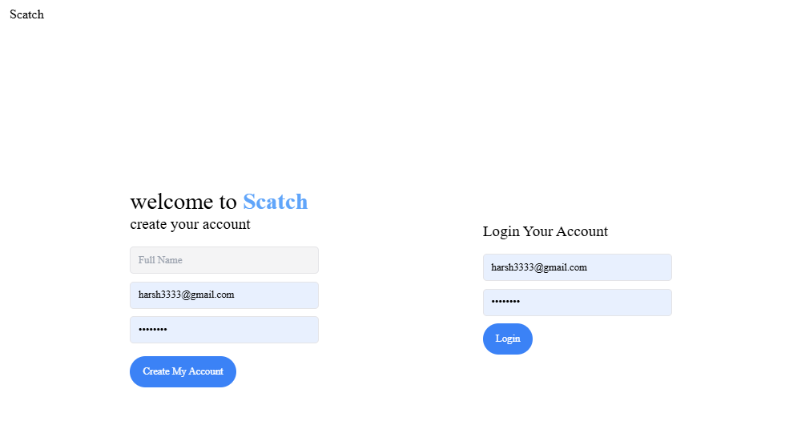
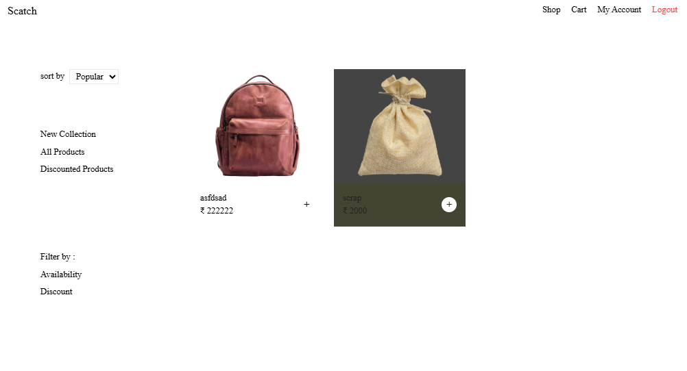
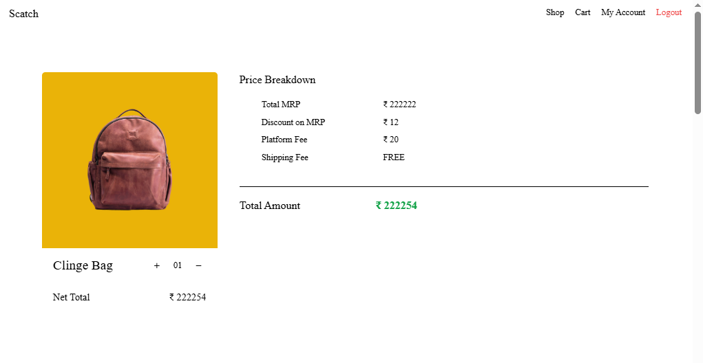

# 👜 Bag Shop App

Welcome to **Bag Shop App** — a stylish full-stack shopping platform where users can browse, add to cart, and purchase bags 🛍️.  
Product owners can register and add their beautiful bag collections for sale!

---

## 🌐 Live Demo

🌐 **Live Demo:** [Click here to visit the site]()

---

## ✨ Features

- 🔐 User Authentication (Register, Login, Logout)
- 🛒 Add Products (for Owners)
- 👜 Browse All Products
- 🛍️ Add to Cart
- 💳 Purchase Products

---

## 🛠️ Tech Stack

| Technology | Description |
|:-----------|:------------|
| **Frontend** | EJS (Embedded JavaScript Templates) |
| **Backend** | Express.js, Node.js |
| **Database** | MongoDB |

---

## 📸 Screenshots

### Home Page

  

### Shop Page

  

### Cart Page

  

---
